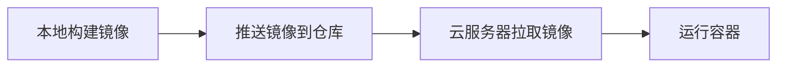

# Docker 镜像构建与部署全流程指南

## 一、Docker 镜像核心概念

### 镜像定义

- 轻量级、可执行的独立软件包，包含应用代码、运行时环境、工具和配置
- **分层结构**：由多个只读层（Layer）堆叠组成，每层代表一次文件系统变更（如安装依赖、复制文件）
- **只读性**：镜像构建后不可修改，更新需添加新层

### 镜像与容器关系

- 镜像是静态模板，容器是镜像的运行实例
- 容器启动时，在镜像层上添加可写层，运行时修改仅影响此层

### 核心用途

- **环境一致性**：解决开发、测试、生产环境差异问题
- **快速部署**：秒级启动，支持水平扩展
- **版本控制**：通过标签管理多版本，便于回滚

## 二、镜像构建优化策略

### 分层缓存机制

**高频变动层置后**：

```dockerfile
# 先安装依赖（低频变动）
COPY requirements.txt .
RUN pip install -r requirements.txt

# 后复制源码（高频变动）
COPY src/ /app
```

**合并指令减少层数**：

```dockerfile
RUN apt-get update && \
    apt-get install -y git curl && \
    rm -rf /var/lib/apt/lists/*
```

### 多阶段构建

分离构建环境与生产环境，仅保留最终产物：

```dockerfile
# 阶段1：构建环境
FROM node:18-alpine AS builder
COPY package*.json ./
RUN npm ci
COPY . .
RUN npm run build

# 阶段2：生产环境
FROM nginx:alpine
COPY --from=builder /app/dist /usr/share/nginx/html
```

**优势**：镜像体积缩小 90%+，避免包含构建工具（如编译器）

### 依赖管理

- **构建依赖**：编译器（gcc）、开发库（python3-dev）
- **生产依赖**：轻量级运行时（Nginx、JRE）
- **锁定版本**：使用 package-lock.json 或 poetry.lock

### 构建上下文优化

**使用 .dockerignore**：

```dockerfile
node_modules
*.log
.git
```

### 分阶段复制文件：优先复制依赖描述文件（如 package.json）。

### 高级工具

启用 BuildKit：加速构建并支持缓存挂载。

```bash
export DOCKER_BUILDKIT=1
docker build --progress=plain .
```

缓存挂载：

```dockerfile
RUN --mount=type=cache,target=/root/.npm \
    npm install
```

## 三、镜像部署到云服务器

### 部署流程



### 详细步骤

构建镜像：

```bash
docker build -t my-app:1.0 .
```

推送镜像（以阿里云 ACR 为例）：

```bash
docker login registry.cn-hangzhou.aliyuncs.com
docker tag my-app:1.0 registry.cn-hangzhou.aliyuncs.com/ns/my-app:1.0
docker push registry.cn-hangzhou.aliyuncs.com/ns/my-app:1.0
```

服务器运行：

```bash
docker pull registry.cn-hangzhou.aliyuncs.com/ns/my-app:1.0
docker run -d -p 80:8080 --restart=always my-app:1.0
```

验证与监控

查看容器状态：

```bash
docker ps -a | grep my-app
```

查看日志：

```bash
docker logs -f my-app
```

## 四、高级场景与优化

### Docker Compose 编排

```yaml
version: '3.8'
services:
  frontend:
    image: my-frontend:1.0
    ports: ["80:80"]
  backend:
    image: my-backend:1.0
    ports: ["3000:3000"]
```

### HTTPS 配置

使用 Let's Encrypt 生成证书，Nginx 反向代理：

```nginx
server {
    listen 443 ssl;
    ssl_certificate /etc/letsencrypt/live/domain.com/fullchain.pem;
    ssl_certificate_key /etc/letsencrypt/live/domain.com/privkey.pem;
    location / {
        proxy_pass http://frontend:80;
    }
}
```

### 健康检查

```dockerfile
HEALTHCHECK --interval=30s --timeout=3s \
  CMD curl -f http://localhost/health || exit 1
```

## 五、安全与最佳实践

### 非 Root 用户运行容器

```dockerfile
RUN adduser -S appuser && chown -R appuser /app
USER appuser
```

### 镜像扫描

```bash
docker scan my-app:1.0
```

### 定期更新

基础镜像（如 Alpine、Distroless）。

应用依赖（通过 CI/CD 自动化）。

## 总结

优化点	效果	关键方法
分层与缓存	减少重复构建耗时	高频变动层置后、合并指令
多阶段构建	镜像体积缩小 90%+	分离构建与生产环境
依赖管理	避免冗余和安全风险	锁定版本、清理无用文件
自动化部署	快速迭代与回滚	CI/CD 集成、镜像仓库

通过合理分层、多阶段构建和工具链整合，可显著提升 Docker 镜像的构建速度和部署效率，实现高效、安全的容器化应用交付。