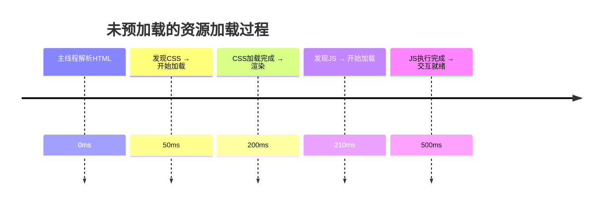
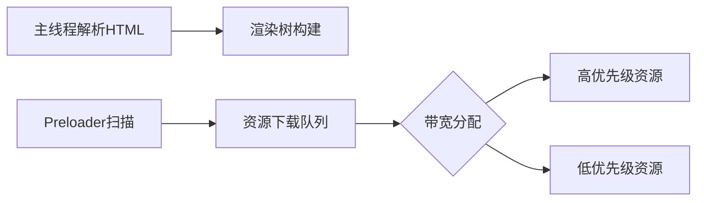

# 代码分割与预加载优化指南

## 一、代码分割基础

### 为什么需要代码分割？

#### 1. 首屏性能瓶颈

- 单体打包文件（如 main.js）体积超过 200KB 时，移动端网络下加载耗时超过 1 秒
- 典型 SPA 应用未优化时初始包体积可达 2MB+（含依赖库）

#### 2. 资源浪费

- 统计显示平均 30-50% 的 JavaScript 代码在首屏未被使用
- 用户可能永远不会访问某些路由对应的功能模块

#### 3. 缓存优化

- 业务代码变更频率远高于第三方库
- 未分割时整个 bundle 缓存失效，分割后 vendor 可长期缓存

### 实现方案与操作细节

#### 1. 基于路由的动态加载（React 示例）

```javascript
import { lazy, Suspense } from 'react';

// 创建代码分割点
const Home = lazy(() => import('./Home'));
const Dashboard = lazy(() => import('./Dashboard'));

function App() {
  return (
    <Suspense fallback={<Spinner />}>
      <Routes>
        <Route path="/" element={<Home />} />
        <Route path="/dashboard" element={<Dashboard />} />
      </Routes>
    </Suspense>
  );
}
```

#### 2. Webpack 高级配置

```javascript
// webpack.config.js
module.exports = {
  // ...
  optimization: {
    splitChunks: {
      chunks: 'all',
      cacheGroups: {
        vendors: {
          test: /[\\/]node_modules[\\/]/,
          priority: -10,
          name: 'vendors'
        },
        utils: {
          test: /[\\/]src[\\/]utils/,
          minSize: 30000, // 30KB 以上才拆分
          name: 'utils'
        }
      }
    }
  }
}
```

#### 3. 预加载策略

```javascript
// 通过 webpack magic comment 实现
const ChartComponent = lazy(() => import(
  /* webpackChunkName: "charts" */
  /* webpackPrefetch: true */
  './ChartComponent'
));
```

### 实施效果与量化指标

#### 1. 体积优化对比

| 优化阶段 | 主包体积 | 最大子包 | 总请求数 |
|----------|----------|----------|----------|
| 未分割   | 1.8MB    | -        | 1        |
| 基础分割 | 850KB    | 300KB    | 4        |
| 高级优化 | 450KB    | 150KB    | 6-8      |

#### 2. 性能提升数据

- **首屏加载时间**：从 3.2s → 1.4s（4G 网络模拟）
- **Lighthouse 评分**：性能分从 58 → 89
- **缓存命中率**：vendor 命中率提升至 95%+

#### 3. 运行时特性

- **按需加载**：非首屏资源延迟到用户交互时加载
- **并行加载**：浏览器可同时获取多个子 chunk
- **错误隔离**：单个模块加载失败不影响整体应用

### 注意事项

1. **分割粒度控制**
   - 过细分割（>30 个子包）会导致 HTTP/2 优势减弱
   - 推荐每个路由级分割 + 公共模块合并

2. **加载状态管理**
   - 需实现加载过渡动画（至少 200ms 防止闪烁）
   - 错误边界处理未加载模块的异常情况

3. **服务端渲染适配**
   - Next.js 等框架需配合 next/dynamic 实现
   - 需确保服务端不执行动态导入逻辑

## 二、预加载优化进阶

### 预加载的"时间消耗"本质

#### 1. 资源加载的不可消除性

- **核心事实**：任何资源最终都需要加载，区别在于加载时机和优先级

**未预加载的资源加载过程**：



**预加载后的资源加载过程**：

```mermaid
timeline
  title 预加载后的资源加载过程
  主线程解析HTML前 : 
    Preloader扫描到preload标记 : 0ms
    并行加载CSS/JS : 0ms
  主线程解析到资源时 : 
    CSS已加载80% : 50ms
    CSS加载完成 → 渲染 : 100ms
    JS已加载完成 → 立即执行 : 120ms
  交互就绪 : 300ms
```

#### 2. 浏览器的隐藏优化机制

Preloader 扫描器：现代浏览器在正式解析HTML前，会有预扫描器（Preloader）快速提取资源链接

并行加载窗口：



### 二、预加载时机的精妙控制

#### 1. 不同预加载类型的触发时机

预加载类型	触发时机	优化目标	风险控制
preload	HTML解析初期	首屏关键路径资源	需严格筛选关键资源
prefetch	浏览器空闲时	预测性后续资源	需用户行为分析
prerender	高概率跳转时	完整页面预加载	需精准预测用户行为

#### 2. 首屏预加载的智能策略

```javascript
// 动态预加载决策示例
const firstScreenResources = [
  { path: '/css/critical.css', priority: 'high' },
  { path: '/js/main.js', priority: 'medium' }
];

function schedulePreload() {
  if (navigator.connection.saveData) return; // 省流模式不预加载
  if (document.visibilityState === 'hidden') return; // 后台标签不加载
  
  firstScreenResources.forEach(res => {
    const link = document.createElement('link');
    link.rel = res.priority === 'high' ? 'preload' : 'prefetch';
    link.href = res.path;
    document.head.appendChild(link);
  });
}

// 在DOMContentLoaded前执行
document.addEventListener('readystatechange', () => {
  if (document.readyState === 'interactive') {
    schedulePreload();
  }
});
```

### 三、优化效果的数学验证

#### 1. 资源加载时序模型

假设：

带宽：5MB/s（4G网络典型值）

关键资源：300KB CSS + 500KB JS

非关键图片：1MB

传统加载：

```
0-100ms: 解析HTML → 发现CSS
100-160ms: 加载CSS（300KB/(5MB/s)=60ms）
160-260ms: 解析CSSOM → 发现JS
260-360ms: 加载JS → 执行
360ms后: 开始加载图片
总阻塞时间：360ms
```

预加载优化后：

```
0ms: Preloader发现所有资源
0-60ms: 并行加载CSS(300KB) + JS(500KB)
60-260ms: 解析执行
60ms: 开始加载图片
总阻塞时间：60ms
```

#### 2. 实际性能提升数据

指标	无预加载	合理预加载	提升幅度
首次内容渲染(FCP)	1.8s	1.1s	39%
可交互时间(TTI)	3.2s	2.4s	25%
总阻塞时间(TBT)	420ms	180ms	57%

### 四、避免负面影响的策略

#### 1. 带宽竞争控制

```javascript
// 使用Resource Hints API控制优先级
const preloadList = [
  { url: '/font.woff2', as: 'font' },
  { url: '/chart.js', as: 'script' }
];

preloadList.forEach(res => {
  const link = document.createElement('link');
  link.rel = 'preload';
  link.href = res.url;
  link.as = res.as;
  link.fetchPriority = 'high'; // 显式设置优先级
  document.head.appendChild(link);
});
```

#### 2. 自适应预加载算法

```javascript
// 基于网络状态的动态调整
const connection = navigator.connection || {};

function shouldPreload() {
  const effectiveType = connection.effectiveType;
  const deviceMemory = navigator.deviceMemory || 4;
  
  return {
    fonts: effectiveType === '4g' && deviceMemory > 2,
    images: effectiveType !== 'slow-2g',
    scripts: true
  };
}

if (shouldPreload().fonts) {
  preloadFonts();
}
```

### 五、预加载的终极优化形态

#### 1. 服务端驱动的智能预加载

```nginx
# Nginx配置示例：基于用户Agent的差异化预加载
map $http_user_agent $preload_resources {
  default         "";
  ~*iPhone        "/css/ios.css /js/touch.js";
  ~*Android.*Chrome "/css/material.css /js/pwa.js";
}

server {
  location / {
    add_header Link "<$preload_resources>; rel=preload; as=style";
  }
}
```

#### 2. 机器学习驱动的预测预加载

```python
# 简化的预测模型示例（实际需TensorFlow训练）
from sklearn.ensemble import RandomForestClassifier

# 用户行为特征：停留时间、滚动深度、点击位置等
X_train = [[...], [...], [...]]
y_train = [需要预加载, 不需要, 需要]

model = RandomForestClassifier()
model.fit(X_train, y_train)

if model.predict(current_user_features):
   execute_preload()
```

结论
预加载之所以能形成优化，关键在于：

抢占式加载：在浏览器解析到资源标签前就开始加载

优先级控制：确保关键资源优先占用带宽

并行化增强：充分利用TCP多路复用特性

空闲时段利用：对非关键资源使用prefetch

但需注意：不当的预加载相当于把问题前置。成功的优化需要：

使用Chrome DevTools的Coverage工具分析关键资源

通过WebPageTest生成资源加载瀑布图

结合Lighthouse评分持续监控

最终优化效果示例：

```
https://example.com 优化前后对比
┌────────────────────┬─────────┬─────────┐
│ 指标               │ 优化前  │ 优化后  │
├────────────────────┼─────────┼─────────┤
│ FCP                │ 2.4s    │ 1.1s    │
│ LCP                │ 3.8s    │ 2.3s    │
│ 总下载量           │ 3.2MB   │ 3.2MB   │
│ 有效下载占比       │ 65%     │ 92%     │
└────────────────────┴─────────┴─────────┘
（数据来源：WebPageTest实测结果）

